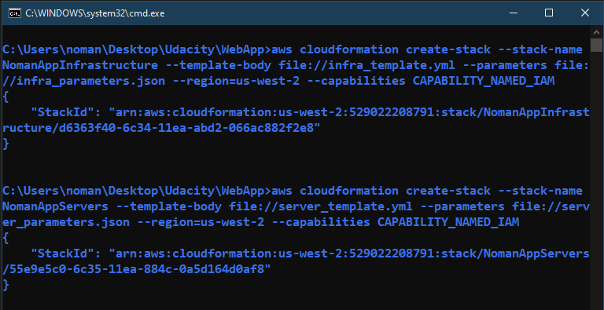
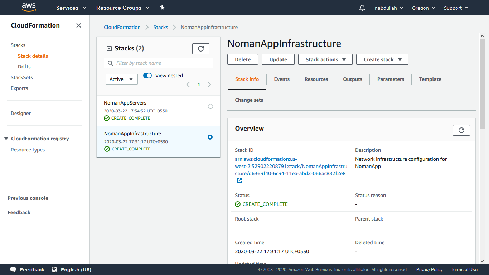
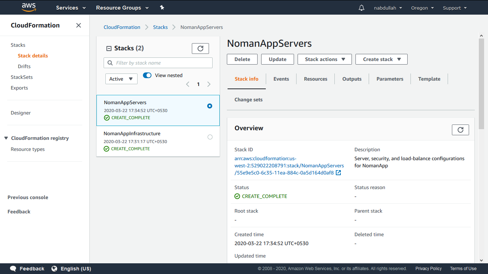

## Deploy a High-Availability WebApp using Cloudformation

### Create the Stacks
There are two templates in yaml format and two parameters file in json format. One for creating network infrastructures and another for creating servers, security groups, loadbalancer and so on.
The two stacks can be created as follows -

First, **NomanAppInfrastructure** stack is created completely and then **NomanAppServers** stack is created. 

Once the stacks are created successfully, verify other services from the AWS console. In this case, all the services' screenshots are given in the **images/screenshots** directory.

Thank you.

### Step 03: Enable Static Website Hosting
We have the website files in our bucket now. It's time to enable the static hosting. In order to do that, We have to select **Properties** tab inside the bucket and then select the **Static Website Hosting**. The index file should be navigated here.

### Step 04: Setup IAM Bucket Policy
To make the bucket contents publicly availabe we have to implement an IAM bucket policy. The policy can be found in the **Permissions** tab and under **Bucket Policy** sub tab. 

### Step 05: Website Distribution
The website should be distributed via CloudFront. For that, the s3 bucket must be connected to a web distribution in CloudFront. Once the connection has been setup properly the website will get an URL with **.cloudfront.net** domain. It will take a bit time to deploy. So, wait until the cloudfront console shows the status as **Deployed**.

**Congratulations!!!**
We have successfully hosted a static website on Amazon Web Services.
