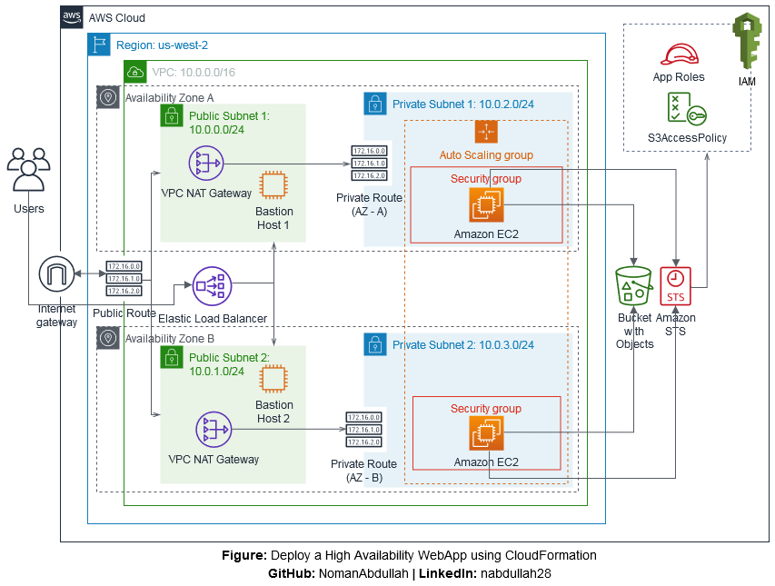

# Deploy-HA-WebApp-Using-Cloudformation

This  is a project to deploy a high-availability web application using AWS CloudFormation.

## High Level Diagram 
This is a detailed architechure of the cloudformation project.

## Services:

	1. CloudFormation
	2. S3 Bucket
	3. VPC
	4. LoadBalancer
	5. Security Groups
	6. Lunch Configuration
	7. AutoScaling

## Prerequisites:
	
	1. AWS Account
	2. AWS Cli
	3. Web Application

## Instructions

Please check the **Instructions.md**
